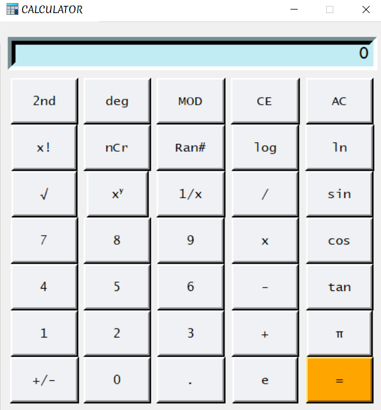

<h1 align="center">SciCalculator GUI</h1>
<h3 align="center">A GUI Application built for Online Science tuitions.</h3>

---

- 💻 Built on Basics of Tkinter, Python's standard GUI interface to the Tk GUI toolkit.

- 🌱 Built to satisfy the needs of a full-fledged Scientific Calculator on our Computers. 

- 💬 Provides 20+ mathematical operations that were specific to the Scientific Calculator, something that is lacking in the Basic Calculators we can find on our Computers.

---
<h3 align="center">Connect with me:</h3>

